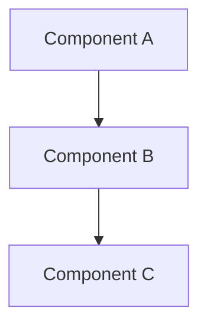
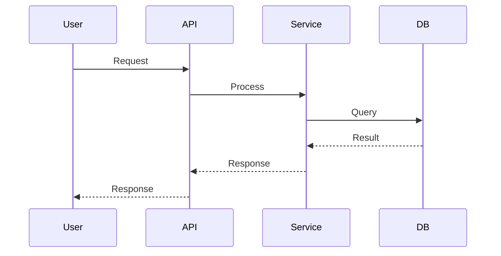
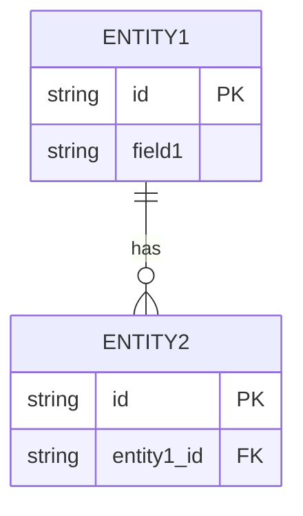

# Design: [Feature Name]

> Created by: architect agent
> Date: [Date]
> Status: Draft | Ready for Review | Approved

## Overview
[Brief description of the design approach]

## Architecture



## Sequence Flow



## Data Model



## Components

### [Component 1]
- **Responsibility**: 
- **Location**: `src/...`
- **Interfaces**: 

### [Component 2]
...

## API Contract (if applicable)

```
POST /api/resource
Request:
{
  "field": "value"
}

Response:
{
  "id": "...",
  "field": "value"
}
```

## Error Handling
- [Error case 1]: [How handled]
- [Error case 2]: [How handled]

## Edge Cases Considered
- [Edge case 1]
- [Edge case 2]

---

**Next Step**: Invoke `reviewer` agent for design review
