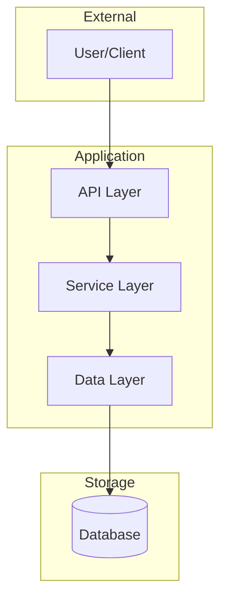

# Project Knowledge Base

> This is the central documentation for [Project Name]. Both humans and AI agents use this to understand the project.

## Project Overview

**What it does**: [Brief description]

**Tech Stack**: 
- Language: 
- Framework: 
- Database: 
- Deployment: 

## Repository Structure

```
project/
├── src/                    # Application code
│   ├── api/                # API endpoints
│   ├── models/             # Data models
│   ├── services/           # Business logic
│   └── utils/              # Utilities
├── tests/                  # Test files (mirrors src/)
├── docs/                   # Additional docs
├── knowledge-base/         # This folder
│   ├── INDEX.md            # You are here
│   ├── overview/           # Architecture summaries with dependency graphs
│   ├── modules/            # Per-module docs with class diagrams
│   ├── architecture/       # Completed designs (archived from handoffs)
│   ├── features/           # Completed feature docs (archived from handoffs)
│   └── decisions/          # ADRs
└── .claude/
    ├── handoffs/           # Agent communication
    └── skills/             # Project-specific agent skills
```

## Key Components

### [Component 1]
- **Location**: `src/...`
- **Purpose**: 
- **Key files**: 

### [Component 2]
- **Location**: `src/...`
- **Purpose**: 
- **Key files**: 

## Documentation Structure

### Overview
- **[overview/architecture-summary.md](overview/architecture-summary.md)** - System architecture with module/package dependency graphs

### Modules
Module-level documentation with class diagrams (generated by knowledge-base agent):
- See `modules/` directory for per-module documentation

### Completed Designs
- **architecture/** - Architectural designs (archived from handoffs after completion)
- **features/** - Feature specifications (archived from handoffs after completion)

### Decisions
- **decisions/** - Architectural Decision Records (ADRs)

## Architecture

See `overview/architecture-summary.md` for detailed dependency graphs. High-level:



## Development Patterns

### Code Style
- [Pattern 1]
- [Pattern 2]

### Testing
- Unit tests in `tests/unit/`
- Integration tests in `tests/integration/`
- Run with: `make test`

## Quick Reference

| Task | Command |
|------|---------|
| Run dev server | `make dev` |
| Run tests | `make test` |
| Lint | `make lint` |
| Deploy staging | `make deploy-staging` |

## Recent Decisions

See `decisions/` for ADRs. Recent:
- [ADR-001]: [Title]

---

*Last updated: [Date]*
